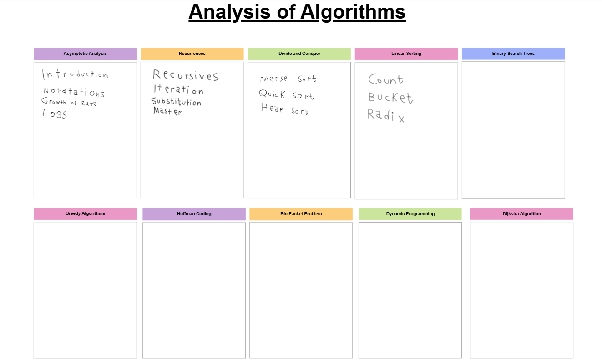

# Analysis-and-Design-Algorithms

Projects for "501435-3 | Analysis and Design of Algorithms Course" in Taif University.

### Syllabus

1. [Asymptotic Analysis](chapters/chapter1.pdf)
2. [Recurrences](chapters/chapter2.pdf)
3. Divide and Conquer
4. Linear Sorting
5. Binary Search Trees
6. Greedy Algorithms
7. Huffman Coding
8. Bin Packet Problem
9. Dynamic Programming
10. Dijkstra Algorithm
